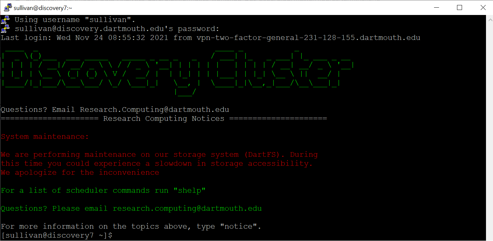
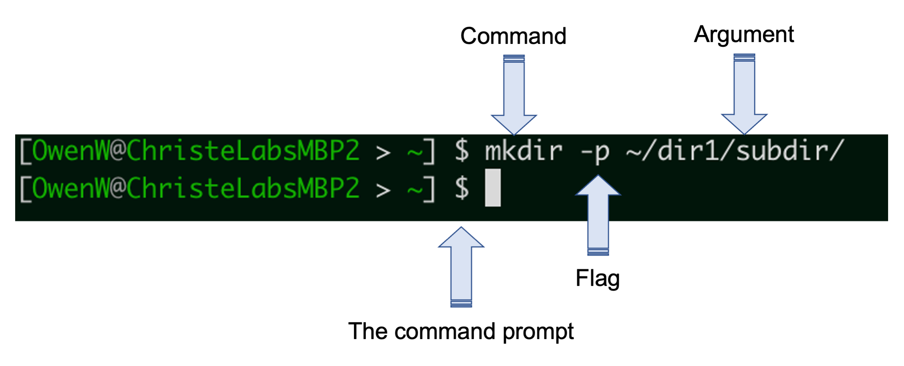

# Unix/Linux Shell basics

The Unix/Linux *'Shell'* describes a program that takes commands from an input (eg. your keyboard) and passes them to an operating system that will execute them. In contrast to a *Graphical User Interface (GUI)* the Shell is simultaneously a *command line interface (CLI)* and a programming language that allows you to perform tasks on your system.

<p align="center">
  
</p>

Interacting with a system through the Shell has many advantages over a GUI. The Shell allows you to quickly and easily navigate through directories on your computer, make, copy and search files in a systematic way, and construct pipelines that will execute complex tasks on big datasets.

Importantly, the Shell allows us to do each of these in the context of Bioinformatics, and Bioinformatics software.

## Why learn to use a Shell?  
Learning to use a Shell can be challenging, however it is a key skill in bioinformatics, as it is the primary way in which we interface with a lot of bioinformatics software and file types.

Some bioinformatics software provides GUIs that enable users execute tasks with programs that you would otherwise execute using the Shell. While such software can be powerful in the right context, they can also make it very easy to perform tasks in bioinformatics incorrectly, and should therefore should treated with caution.


## The Bash shell

### The absolute basics

There are different types of Unix shells, however the most popular is Bash (the *Bourne Again Shell*), which is also the most common on Linux sysetms. Since the majority of participants will be using the Bash shell, and this is the default shell used on Dartmouth's high performance computing system (which we will be using), this lesson will be introduce the Shell through using the Bash shell, however most, if not all, content should be transferable to other Unix shells.

> Use the Cheat Sheet in the GitHub repo to help you learn commands and available options.

Accessing the (bash) shell:  
- On a Mac or Linux system, the *Terminal* application provides access to the shell. There are also applications that you can download that provide customizations not present in the Terminal application, such as [iTerm2](https://iterm2.com/).
- On a Windows system, you can use an application such as [MobaXterm](https://mobaxterm.mobatek.net/) or [PuTTY](https://www.putty.org/).

<p align="center">
  
</p>

When you open your terminal application you will be presented with the command prompt `$` when you are able to input commands. If the terminal is busy and cannot currently accept new commands, you will not be presented with the prompt.

When the prompt is shown, you can enter commands by typing them in after the prompt. Commands are typically composed of three components:  
- the name of the command itself  
- any flags or options you wish to run the command with (not always required)
- a file or directory to act on (sometimes implicit)

In the above example, we are asking the Shell to pass the `mkdir` command to the operating system (for making directories) with the `-p` option (which lets us make parent and sub directories at the same time) and the argument detailing what directory we want the command to make.

Manual pages for specific commands can be accessed using the `man` command.
```bash
man mkdir
```

The shell provides us with commands that allow us to list files in our current working directory, as well as change the current working directory to another location. For example:
```bash
# 'ls' command lists files in our current working directory
ls

# run ls with the '-a' option to include hidden files
ls -a

# The pwd command shows you your current working directory
pwd

# cd allows you to change your current working directory ('.' means current directory)
cd .

# '..' tells the shell to move your current directory up one directory
cd ..

# check you directory again
pwd

# now go back down the tree.  Replace the directory name with your own.
cd OwenW/
pwd
```

To go back down the directory structure, we specified a directory that was in our current working directory (cd). This is called a **relative path**, since it is relative to our current directory and will only work if our current directory is relative to the directory we are trying to reach.  

Relative paths are contrasted to **absolute paths** which always starts with a '/' and will start at the root (highest level) of the directory tree, and work from wherever you are in the directory substructure. For example:
```bash
ls /Users/OwenW/
```

By default, your terminal application will start your current directory as your *home directory* (more on that later). No matter where you are, you can always get back to your home directory using the tilde `~` with the `cd` command.
```bash
cd ~
```

Another useful command is `echo` which will evaluate and print characters provided to it.
```bash
echo "words words words"
```

We can use the redirect command (>) to redirect the output of commands like echo into a file. As an example, lets save the important note we made above to a text file.
```bash
echo "words words words" > mynotes.txt
```
## Log on to discovery cluster

Many of the higher level commands for working with NGS data will require a lot of memory and computing power, more than most laptops can handle efficiently.
The discovery cluster is a resource hosted by Dartmouth's Research Computing team. This cluster enables you to execute high level commands without using the memory and computing power on your local machine (more on this soon). Let's log onto the discovery cluster now. We will use a secure shell command `ssh` to log onto the discovery cluster.

```bash

# Establish the secure shell connection
ssh netID@discovery.dartmouth.edu

# Enter your password at the prompt (when you type no characters will show up to preserve privacy)
netID@discovery.dartmouth.edu's password:

# You're in!
(base) [netID@discovery7 ~]$

```
The commands that you just executed locally in your terminal window work the same way when you are logged into discovery. It is always useful to orient yourself when you're working on an HPC so that you know where the output of all of the commands you run will end up. Let's run our first command to get your location.

```bash

# Check your location on the cluster
pwd

```

You should see something like `/dartfs-hpc/rc/home/h/netID` displayed in response to your command. Initially when you log on you will always be directed to your home directory (the address or path listed above). Your home directory by default will have 50GB of storage space to begin with, if you are running something that requires more storage space it is possible to extend that limit temporarily with the `/dartfs-hpc/scratch/ drive`. This is where we have stored all of the files you will be working with today. Directories and files hosted on the `/dartfs-hpc/scratch/` drive will only be kept for 45 days, you will receive a notification from Research Computing before the data is deleted.

It is a good idea when working on projects on an HPC to stay organized, so let's start by making a folder, or directory, to store all of the work you do today we will call it `fundamentals_of_bioinformatics`. You will notice that I chose a title that has no spaces in it, this is because the space is a special character, special characters need to be *escaped* with the `\` and so `funadmentals_of_bioinformatics` would look like `fundamentals\ of\ bioinformatics` with the escape characters. You can see that file names with spaces become unwieldy to type out so most programmers will replace spaces with `_`, `.`, or `-` in their filenames to keep everything neat.

```bash
# Navigate to scratch so you can make your own directory there 
cd /dartfs-hpc/scratch/

# Make the directory.  Replace 'omw' with your own username.
mkdir -p omw/fundamentals_of_bioinformatics

# Change to the newly-created directory.
cd omw/fundamentals_of_bioinformatics

# Set an alias so we can get here quickly 
alias biow="cd /dartfs-hpc/scratch/omw/fundamentals_of_bioinformatics"
# NOTE: you can add this line to your .bashrc so it get run every time you log in, we will cover this below 

# Check your location on the cluster
pwd

# List the contents of your directory
ls

```
As expected, the new directory that you created is empty there are no files. Lets copy a file from the `/dartfs-hpc/scratch/` directory we created for this workshop to the directory you just created. This file (`all_counts.txt`) provides raw read counts for an RNA-seq experiment, with genes in rows and samples in columns.

```bash

# Copy the file from the scratch drive to the fundamentals_of_bioinformatics directory you just created
cp /dartfs-hpc/scratch/fund_of_bioinfo/all_counts.txt ./

```


### Viewing the contents of files

The shell provides us with commands to view the contents of files in define ways. The `cat` command for example (which stands for for concatenate) will print the entire contents of a file to the terminal. This can be useful for smaller files, but as you will see with larger files can quickly fill the terminal with more lines of data than it can display.

```bash
cat all_counts.txt
```

When working with larger files, which we are usually doing in bioinformatics, you may not wish to print the whole file as it would overrun your terminal. Other commands exist that allow you to explore file contents with more control.
- `more` shows you as much of the file as can be shown in the size of the terminal screen you have open, and you can continue to "scroll" through the rest of the file by using the space bar  
- `less` is a similar command to `more`, and has advantages such as not persiting in the terminal, and being searchable
- `head` will print the first 10 lines by default, but this number can be controlled with the `-n` option
- `tail` will print the final 10 lines of a file, and can also be controlled with the `-n` option

We will use a larger text file to show the utility of these commands, as well as other commands in the subsequent parts of this lesson.
```bash
# Show the first 20 lines of the all_counts.txt file
head -n 20 all_counts.txt

# Show the last 50 lines of the all_counts.txt file
tail -n 50 all_counts.txt

# Use the word count (wc) command with the lines option (-l) to show how many lines (rows) are in the dataset
wc -l all_counts.txt
```

### Renaming and removing files

Sometimes you will need to reorganize your directories or rename a file, which can be achieved with the `mv` command. Let's start by copying the all_counts.txt file from the fundamentals_of_bioinformatics directory to your home directory.

```bash
# Copy the all_counts.txt file to your home directory
cp all_counts.txt ~/all_counts.txt
```
Now let's rename the copy of the all_counts.txt file that we just created.
```bash
# Rename the copied all_counts.txt file
mv ~/all_counts.txt ~/all_counts.copy.txt
```
You can also use the `mv` command to move a file to a new location. Let's move the all_counts.copy.txt from your home directory into your fundamentals_of_bioinformatics directory.
```bash
# Move the all_counts.copy.txt into your fundamentals_of_bioinformatics directory.  Replace scratch directory with your own.
mv ~/all_counts.copy.txt /dartfs-hpc/scratch/omw/fundamentals_of_bioinformatics/all_counts.copy.txt

#check the contents of your fundamentals_of_bioinformatics directory
ls
```

Copying the all_counts.copy.txt file was just an exercise to show you how the tools work, in practice you will want to keep your directories as neat as possible as you accumulate a lot of files. Let's remove the all_counts.copy.txt file with the `rm` command.

```bash
# For the sake of being careful, let's first list the details file to be removed
ls -l all_counts.copy.txt
# Remove the all_counts.copy.txt file
rm all_counts.copy.txt
```

You will notice that before the file was deleted you were asked if you were sure you wanted this file deleted. You want to be careful not to remove files that you did not create if you are working in shared directories. If you want to bypass this checkpoint, you can use the `-f` flag with `rm -f` to force the removal of a file, but be careful with this, as there is no *Trash* equivalent in the shell.

### Manipulating file contents

Some commands enable you to manipulate and subset files based on specific parameters. One useful example is the `cut` command, which allows you to 'cut' a file based on the options you select, such as the `-f` option, which corresponds to fields (columns). We could use `cut` to obtain read counts for only the first 5 samples in `all_counts.txt`.
```bash
# Look at only the counts from the first five columns
cut -f 1,2,3,4,5 all_counts.txt
```

To prevent all rows being printed to our console, we could combine the `cut` command with the `head` command using a *'pipe'*, specified by a '|'. Pipes send the output an initial command to a subsequent command, all in the same line, to allow the output of the first command to be used as the input to the second.
```bash
# List only the first 20 lines of only samples SRR1039508 (col 2) and SRR1039523 (col 17)
cut -f 1,2,17 all_counts.txt | head -n 20
```

Similarly to how we used the pipe operator (|) above, we could use the redirect operator(>) to send the output of the cut command to create a new counts file, that only contains the columns 1 (gene IDs), and samples in columns 2 and 17.
```bash
# Print the counts from SRR1039508 and SRR1039523 to a new file
cut -f 1,2,17 all_counts.txt > all_counts_sub.txt

# look at head of this new file
head all_counts_sub.txt
```

### Pattern matching with *grep*

Often we will want to pull a specific piece of information from a large file, let's say that we were interested in the read counts for a specific gene, ALDH3B1 (Ensembl ID: ENSG00000006534). We can use the `grep` command to search for this ID, or any other character string we are interested in, in our counts matrix.
```bash
# Get the count data for ENSG00000006534 (ALDH3B1) from all_counts.txt
grep "ENSG00000006534" all_counts.txt
```

`grep` is a pattern recognition tool that searches in files for a character string we can define. We can define the entire character string, as we did above, or combine regular characters with special characters (or 'wildcards') to search for specific types of matches. Some commonly used special characters are included in the table below.

Operator | Effect
---|---
\* | wildcard stands for any number of anything
^ | start of the line
$ | end of the line
[0-9] or \d| any number (0123456789)
[a-z]| any lowercase letter
[A-Z]| any uppercase letter
\t | a tab

These regular expressions can be used with any of the tools that you have learned thus far, so if we wanted to list all of the files in our directory that end in .txt we could use the following command.

```bash
# List all files that end in .txt
ls *.txt
```

We can even enhance the power of these regular expressions by specifying how many times we expect to see the regular expression with quantifiers.

Quantifier| Operation
---|---
X* | 0 or more repetitions of X
X+ | 1 or more repetitions of X
X? | 0 or 1 instances of X

Now let's use some of these regular expressions in a `grep` command  to see their utility. Let's use regular expressions to see how many genes have zero reads counted for the first four samples. The flag `-P` indicates that we will be using perl-style regular expressions in the pattern we are searching for, you can use `grep --h` to learn more about available flags for the `grep` command. 

```bash
# Count the number of genes with no reads in the first four samples
grep -P "^ENSG[0-9]*\t0\t0\t0\t0\t" all_counts.txt| wc -l

# Count the number of genes with no reads expressed in any of the samples
grep -P "^ENSG[0-9]*\t0\t0\t0\t0\t0\t0\t0\t0\t0\t0\t0\t0\t0\t0\t0\t0$" all_counts.txt| wc -l
```

### Shell environment variables

The command line *environment* essentially describes a collection of variables that have been set to provide context for the commands that you run. These variables are referred to as *environment variables*. Several environment variables are set automatically every time you log into the bash shell. The `env` command will show all environment variables available in the current shell. Try that now:
```bash
env
```

One important environment variable is `$HOME`, which contains the path to your home directory. Variables such as HOME can be evaluated by placing the `$` in front of them. For example:
```bash
echo $HOME
```

Variables can also be set then called as needed. These can be virtually anything. For example, perhaps you want to save the name of the genome version you are working with in your current session, so it can be easily called multiple times in some bash code you are writing.
```bash
# set the variable
genv="hg38.patch13"

# call it with echo and the $
echo $genv
```

You can also use variables to store commands that you want to run without having to type the entire command out each time. For example, we might run the `ls` command often with the flags `-lah` to show files in a list format, including all hidden files, and with file sizes in human readable format. The entire command would be `ls -lah`, however if we save the command to a variable, and then call the variable directly, the command will be evaluated by the shell.

```bash
# save to variable
ll="ls -lah"

# call variable to execute command
$ll
```

It is possible to make variables you add to your environment persistent, meaning those changes will define your environment each time you start a new bash session. This can be achieved by adding the variable assignment to one of the *environment files*, which are a set of files that are executed everytime you start a new bash session. These files are typically hidden, so we need to use `ls` with the `-a` flag to see them.

List all files in your home directory and locate the `.bash_profile` environment file, and view its contents with the `cat` command.

```bash
# navigate to your home directory
cd ~

# view files in current working directory and include hidden files
ls -a

# view contents of bash profile
cat .bash_profile
```

The `.bash_profile` is run every time you start a bash session and contains variables used to configure the bash environment. You can add lines to the `.bash_profile` to set environment variables that will be established each time you start a new session. Lets add the command we created above to our `.bash_profile`.
```bash
# use the nano text editor to add the line ' ll="ls -lah" ' to your bash_profile
nano `.bash_profile`

# source the new bash_profile to add the environment variables to your current session (or start a new bash session)
source ~/.bash_profile

# now run the command as we did above
$ll
```

Now `$ll` will be set as an environment variable every time we start a new bash terminal. It is also possible to avoid using the `$` to evaluate this variable by using the `alias` command in bash. `alias` allows you to set command that can be called directly using whatever characters you define, and can be added to your `.bash_profile` in the same way as we did above.

```bash
# make an alias for the ls -lah command
alias ll="ls -lah"

# call command directly with ll
ll
```

Another effective use of an alias is for accessing specific directories quickly. For example, if we had a project sub directory that we regularly want to access, such as `~/project/with/many/directories/`, we would need to write this out every time to get there from our $HOME directory, using `cd /project/with/many/directories/`. Using an alias, we can save this command so that it is more easily callable.
```bash
# make a long directory path that you may want to get to quickly in the future
mkdir -p ~/project/with/many/directories/

# make an alias for it
alias pd="cd ~/project/with/many/directories/"

# now call the alias
pd

# check your current dir
pwd
```

Again, just like above, we could add this line defining the alias command to our `.bash_profile` to make this alias available every time we start a new bash session, without even having to set it (after we have put it in our `.bash_profile`). Do this again with nano:
```bash
nano .bash_profile
```

### The $PATH environment variable

Another very important environment variable is `$PATH`, which stores a list of directories that tells bash where specific programs that we want to be available to us are stored. Programs are executable files, and bash needs to know where these files are in order to run the commands as we call them.

The list is stored as strings separated by colons, so that many directories can be defined. Use `echo` to print `$PATH` variable.
```shell
echo $PATH

# Make the output more readable using 'tr' to swap the colons for newlines
echo $PATH| tr ":" "\n"
```

As you can see, many of the directory names end in `bin` which standards for *binary*, which is a common directory name to store executables (programs).

Importantly, you can add directories to your `$PATH` as you either create or install programs, making them available to you as executables. Since the `$PATH` variable is set each time your `.bash_profile` is run at the start of a new session, the executables you add to `$PATH` will be available for you in a new bash session, without having to add them to your `$PATH` again.

We will create an executable file and add it to our $PATH in another lesson, however below is a toy example of how you would add a new executables directory to your `$PATH` variable:
```
export PATH="~/location/of/new/executables:$PATH"
```

A command for finding where a program lives in the $PATH is the `which` command. This can be useful for debugging environment issues as they arise when trying to use or install new software. Check where the executable for the `echo` command is located.  The `which` command :
```r
which echo
```

Many commands like `ls` will also accept wildcards, which are special character instances that allow you to do things like operate on multiple files at one time, or search for specific patterns (either in files or file names). A wildcard character is the asterisk, which can be used to represent any number of characters.
```bash
# list all files in my current directory with the file extension .txt
ls *.txt
```

### Customizing your environment

You will notice the prompt in your terminal when you are logged onto discovery starts with the term `(base)` what this is indicating is that the environments loaded in your .bash_profile are the tools that are available for you to use. For this workshop (and for most NGS data processing) you will need to extend the software packages that are available to you.

We will do this now by loading a new environment with the tool `conda`. We have pre-built this `conda` environment for you such that all of the tools you will need have been loaded into this environment, you should have created this environment with the commands included in the welcome and setup email. Tomorrow we will talk more about how to create your own custom `conda` environment.

```bash
# Load conda environment
conda activate bioinfo
# Check your PATH compared to before activating, note the additional binaries folder
echo $PATH| tr ":" "\n"
```
This should change the word at the beginning of your prompt from `(base)` to the name of the conda environment that you just loaded `(bioinfo)`.

> As we move through the subsequent lessons, we will introduce more complex bash commands in order to manipulate common bioinformatics file types. If you are ever confused about what a command does, remember you can always use `man` to check out the manual page (or Google it). It you are confused about how commands are used in conjunction with each other, it can also be helpful to break them down and run parts individually, in order to understand what the constituent parts do.

### Logging in to an compute node on Discovery ### 

When you log into Discovery using SSH, your session will begin on a computer known as a head node.  This is a computer that sits atop the computing cluster, and should be used for setting up programs or managing files, but not for large-scale computational tasks.  In this workshop, we will be running our tasks interactively, by asking the job scheduler to assign us a compute node on the cluster to work on.  Running the following command will ask for sufficient resources:
```bash
srun --nodes=1 --ntasks-per-node=1 --mem-per-cpu=4GB --cpus-per-task=1 --time=08:00:00 --partition=standard  --pty /bin/bash
```

When you are finished with your computations, you can exit the compute node with the 'exit' command:
```
exit
```


### Breakout room activities

- PRACTICE the bash commands - getting muscle memory for these commands and how to combine them and how they work are going free up your brain power to think about the analysis you want to perform rather than the commands you need to use. 
- Check out the cheat sheet links
