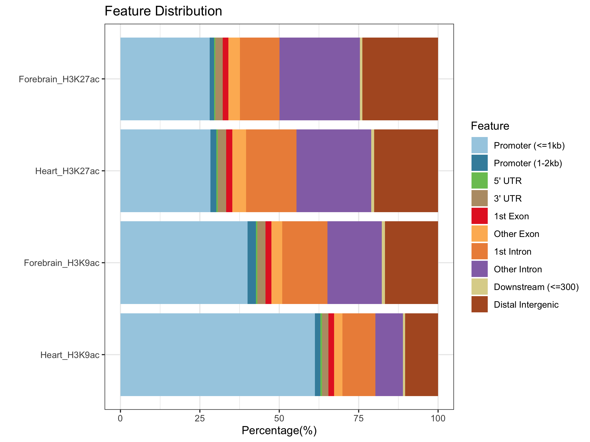

# Optional Exercise: Annotation of ChIP-seq data

This optional exercise accompanies lesson *Working with genomics data in R/Bioconductor - Part II (Genome Annotation)*. You may complete this exercise at home after the workshop, or during any session where you have extra time.

---

### Annotate GRangesList's using TxDb objects

In a previous example, we annotated genomic variants identified through The Cancer Genome Atlas (TCGA) [*Pan-Cancer Analysis of Whole Genomes (PCAWG) project*](https://www.nature.com/articles/s41586-020-1969-6) with their associated genes and transcripts using a TxDb object.

Another example situation of how you might use a TxDb object is in the annotation of peak regions from a ChIP-seq experiment. To demonstrate how we could approach this task, we will return to the ChIP-seq data from [Gorkin *et al*, *Nature*, 2020](https://www.nature.com/articles/s41586-020-2093-3) used in the previous lesson, which describes the dynamic chromatin landscape of the developing mouse.

Start by reading the peak regions back in from the narrowpeak files:
```r
# we will use a pre-loaded txdb for mm10 in this example
library(TxDb.Mmusculus.UCSC.mm10.knownGene)

# set txdb to variable
txdb <- TxDb.Mmusculus.UCSC.mm10.knownGene

# set extracols for reading in narrowpeak data
extraCols_narrowPeak <- c(signalValue = "numeric", pValue = "numeric",
                          qValue = "numeric", peak = "integer")

# forbrain H3K27ac ChIP-seq peaks
fr_h3k27ac <- rtracklayer::import("forebrain_E15.5_H3K27ac.bed",
                                  format = "BED",
                                  extraCols = extraCols_narrowPeak,
                                  genome = "mm10")

# heart H3K27ac ChIP-seq peaks
ht_h3k27ac <- rtracklayer::import("heart_E15.5_H3K27ac.bed",
                                  format = "BED",
                                  extraCols = extraCols_narrowPeak,
                                  genome = "mm10")

# forbrain H3K9ac ChIP-seq peaks
fr_h3k9ac <- rtracklayer::import("forebrain_E15.5_H3K9ac.bed",
                                 format = "BED",
                                 extraCols = extraCols_narrowPeak,
                                 genome = "mm10")

# heart H3K9ac ChIP-seq peaks
ht_h3k9ac <- rtracklayer::import("heart_E15.5_H3K9ac.bed",
                                 format = "BED",
                                 extraCols = extraCols_narrowPeak,
                                 genome = "mm10")

# combine with H3K27ac peak sets to make GrangesList objects
fr <- GRangesList("h3K27ac" = fr_h3k27ac, "h3K9ac" = fr_h3k9ac)
ht <- GRangesList("h3K27ac" = ht_h3k27ac, "h3K9ac" = ht_h3k9ac)
```

To annotate the genomic context of the ChIP peaks, we will use functionality from the Bioconductor package [*ChIPseeker*](https://bioconductor.org/packages/devel/bioc/manuals/ChIPseeker/man/ChIPseeker.pdf) which provides object classes and methods for ChIP-seq peak annotation and visualization.

The specific function we will use to perform the annotation is the `annotatePeak` function, which accepts a *TxDb* class object directly to define the regions that the peaks should be annotated based on. Lets `annotatePeak` on the forebrain H3K27ac peak set.
```r
# load the chipseeker package
library('ChIPseeker')

# run annotatePeak
fr_h3K27ac_anno <- annotatePeak(fr$h3K27ac, tssRegion=c(-2000, 1000), TxDb = txdb)
fr_h3K27ac_anno

# extract and print the annotation data
fr_h3K27ac_anno <- fr_h3K27ac_anno@anno
fr_h3K27ac_anno

# what class is it
class(fr_h3K27ac_anno)
```

It would be useful if we could run `annotatePeak()` on all samples in one line. We can achieve this using `lapply()`:
```r
annolist <- lapply(list(fr$h3K27ac, ht$h3K27ac, fr$h3K9ac, ht$h3K9ac),
                   annotatePeak,
                   TxDb=txdb,
                   tssRegion=c(-2000, 1000), verbose=FALSE)

# set the names for each element of the list
names(annolist) <- c('Forebrain_H3K27ac', 'Heart_H3K27ac',
                     'Forebrain_H3K9ac', 'Heart_H3K9ac')

annolist
annolist[[1]]
annolist$Forebrain_H3K27ac
```

One way to explore the annotations and compare them across peak sets is to use the `plotAnnoBar()` function from *ChIPseeker*, which plots the proportion of peaks falling into each of the annotation categories.
```r
plotAnnoBar(annolist)
```

<p align="center">

</p>

While the proprotion of H3K27ac peaks distributed across the various annotation groups seem relatively stable between the forebrain and heart peak sets, there seems to be a substantially larger proportion of promoter-associated peaks in the H3K9ac peak set from heart tissue compared to that of the forebrain. Perhaps this suggests more transcriptional activity in the heart tissue.

If we were interested in specifically exploring the promoter-associated peaks further on their own, we could subset them.

```r
#extract annotation data for heart h3k9ac
ht_h3K9ac_anno <- annolist$Heart_H3K9ac@anno

# subset for promoter-associated peaks
ht_h3K9ac_anno_promoter <- ht_h3K9ac_anno[ht_h3K9ac_anno$annotation=="Promoter (<=1kb)" |
                                              ht_h3K9ac_anno$annotation=="Promoter (1-2kb)"]
ht_h3K9ac_anno_promoter
```

If we wanted to create a flat file storing the annotated peaks in a sharable file type, we could do this simply by converting the GRanges object to a data frame, and writing that dataframe to a `.csv` file.
```r
# convert GRanges to dataframe
df1 <- as.data.frame(fr_h3K27ac_anno)

# write to csv
write.csv(df1, file = "forebrain_h3K27ac_peaks_annotated_mm10.csv")
```

A far more comprehensive tutorial and description of the ChIPseeker package is available online at the [Bioconductor website](http://bioconductor.org/packages/devel/bioc/vignettes/ChIPseeker/inst/doc/ChIPseeker.html).

---
