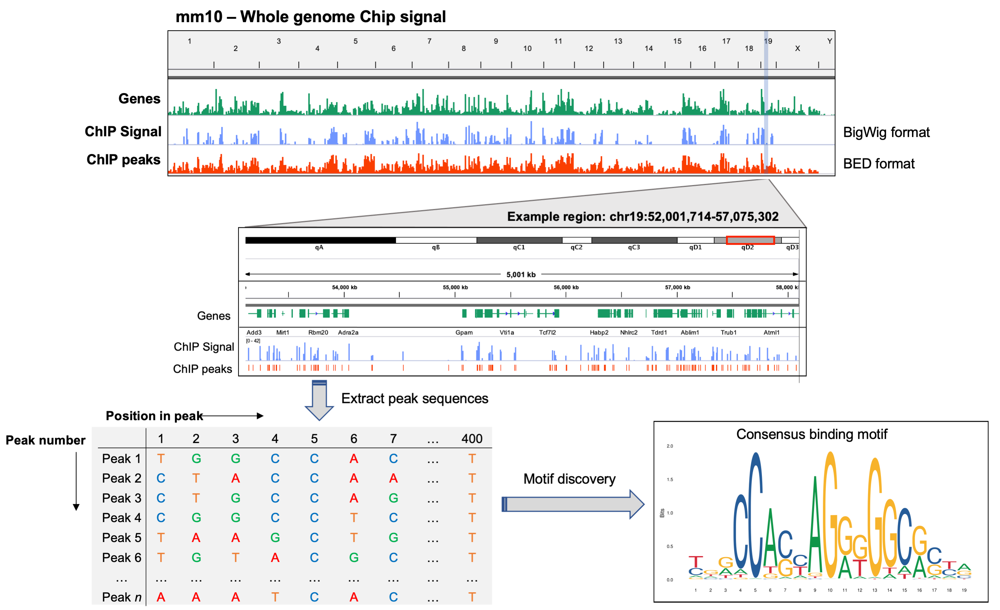

# Working with genomics data in R/Bioconductor - Part II

## Genome annotation & reference genomes

Bioconductor provides a number of packages that allow users to perform advanced genome annotation tasks in a programmatic way. Furthermore, Bioconductor packages also offer convenient and efficient ways to interface with common reference genomes, and can facilitate complex sequence analysis tasks using these reference genomes.

In this lesson we will introduce you to some of these packages and explore their basic functionality. We also provide links to a number of additional **optional lessons** that provide more in depth examples of how these packages can be used to accomplish specific data analysis tasks common in genomics.

---

## Learning objectives:

- Gain an appreciation for how Bioconductor packages can be used to perform genome annotation
- Understand how Bioconductor can be used to obtain & analyze common reference genomes

Set your working directory to point to the `Day-3/data/` folder:
```r
## You may need to ammend this path to the full path of where you have cloned the github repo on your machine
setwd("Bioinformatics_workshop-Dec-2021/Day-3/data")
```

---

### Genome annotation with Bioconductor:

Commonly in genomic data analysis, we want to provide additional context to our data that helps us address our hypothesis. We often achieve this through integrating results from an analysis with publicly available annotation data. Bioconductor provides functionality to directly interface with many popular annotation databases (NCBI, Ensembl, GenBank, UniProt) and import these data into your R environment as Bioconductor type objects (e.g. GRanges).

Examples of common annotation tasks include:  
* Mapping unique gene identifiers (e.g. ENSEMBL or NCBI IDs) to gene symbols in an RNA-seq experiment
* Identifying coding variants from a WGS/WES dataset based on transcriptional context (e.g. coding variants)
* Annotation of genomic context for peak sets from an ChIP- or ATAC-seq experiment (e.g. promoter, intron, exon, intergenic)

Numerous packages are available for such annotation through Bioconductor. Some are built to provide access to specific annotations from a particular database, while others are designed to provide broad access to a number of databases (e.g. Ensembl, NCBI, Biomart).

| **Package/package-family** | **Contents & uses**                                                |
|------------------------|-------------------------------------------------------------|
| *AnnotationDbi*      | Methods for accessing data from SQLite-based annotation packages |
| *GenomicFeatures*   | Methods for storing and manipulating transcriptome annotations using the *TxDb* object class  |
| *Org.X.db*               | Gene-based annotation for current genome versions, useful for mapping IDs, symbols and identifiers |
| *EnsDb.X.vX*   | Access to the most up-to-date transcriptome annotations directly from Ensembl       |
| *biomaRT*   | Release-specific transcriptome annotations from Ensembl for any version or organism     |
| *BS.genome*              | Full sequences for common reference genomes                 |
| *genomation*             | annotation of genomic context and basic data visualization  |

In this lesson, we provide examples of how specific Bioconductor packages can be used for particular annotation tasks, however it is worth noting that we are really only scratching the surface in terms of potential annotation applications that Bioconductor packages can be used for. To provide a more expansive introduction to these applications, please see the **optional lessons** in the `Day-3` folder.

---

### Mapping gene identifiers with *Org.X.DB*

OrgDb represents a family of Bioconductor packages that store gene identifiers from a numerous annotation databases (e.g. gene ontologies) for a wide range or organisms. For example, `org.Hs.eg.db` loads the current annotations for human genes, `org.Mm.eg.db` for mouse, `org.Sc.sgd.db` for yeast, and so on.

OrgDb packages also provide access to some basic additional annotation data such as membership in gene ontology groups. Just as we did in the last lesson, you can navigate through Bioconductor's package index to view all of the existing Org.X.db packages [here](https://www.bioconductor.org/packages/release/BiocViews.html#___OrgDb).

**Note:**OrgDb packages contain annotation data for the most recent genome annotation for that organism, and are therefore not build specific. If you need to annotation for a specific genome build (e.g. h19 vs hg38) you may want to use a different annotation package.


Load the org.db package for the human genome:
```r
library(org.Hs.eg.db)
```

Once loaded, OrgDB allows access to the annotation data for the package you loaded through hidden objects that can be accessed using a set of common Org.Db functions. For example, we can access data from the `org.Hs.eg.db` package after loading it by using the hidden object *org.Hs.eg.db*.
```r
org.Hs.eg.db

# what class is it
class(org.Hs.eg.db)

# what types of data can be extracted?
keytypes(org.Hs.eg.db)
```

OrgDb objects use the `keytypes()` function to access specific types of data from the annotation source. We can ask OrgDb to return a specific keytype that we are interested in.
```r
# obtain all ENSEMBL IDs
entrez.ids <- keys(org.Hs.eg.db, keytype="ENSEMBL")
head(entrez.ids)

# how many are there
length(entrez.ids)
```

The situation we usually end up in however, is when we want to return a set of keytypes given one set of keytypes, for example, returning the gene symbol, entrez ID, and RefSeq ID from a list of Ensembl IDs. For this we can use the `select()` method or `mapIds()` method.
```r
# use ensembl id of first 6 in entrez.ids to get desired keytypes
select(org.Hs.eg.db, keys = head(entrez.ids), columns = c("SYMBOL","ENTREZID", "REFSEQ"), keytype="ENSEMBL")

# using mapIds but only to get gene symbol
mapIds(org.Hs.eg.db, keys = head(entrez.ids), column = c("SYMBOL"), keytype="ENSEMBL")
```

---

### RNA-seq results annotation using OrgDb  

Lets apply this approach to annotate some real RNA-seq differential expression results. Start by reading in the data, currently stored in `.csv` format.
```r
# read in data
results <- read.csv("diff-exp-results.csv", stringsAsFactors = F, row.names = "ensembl")

# check the first few lines  
head(results)
```

Now use mapIDs to obtain 1:1 mappings between the Ensembl ID and the gene symbol.
```r
# using mapIds but only to get gene symbol
gene.symbols <- mapIds(org.Hs.eg.db, keys = rownames(results), column = c("SYMBOL"), keytype="ENSEMBL")

# add a symbols column to results with the gene symbols we just retreived
results$symbol <- gene.symbols

# check the new results table
head(results)

# make sure there are no NAs in the symbols column we just created
table(is.na(results$symbol))
```

Uh Oh! There are lots of NAs, meaning many genes didn't have a symbol mapped to them... Turns out Org.Db is most built around **entrez IDs** from NCBI and does not contain the annotations for many Ensembl genes, which includes a lot of non-coding RNAs like lincRNAs. Instead, we can use an Ensembl package, `EnsDb.Hsapiens.v86` to pull data directly from Ensembl.

```r
library(EnsDb.Hsapiens.v86)
```

Now lets use `EnsDb.Hsapiens.v86` to retrieve annotation data for our genes and see how many missing genes occur.

```r
# using mapIds but only to get gene symbol
gene.symbols.2 <- mapIds(EnsDb.Hsapiens.v86, keys = entrez.ids, column = c("SYMBOL"), keytype="GENEID")

# how long is it
length(gene.symbols.2)

# how many NAs
table(is.na(gene.symbols.2))
```

Fewer NAs are identified, meaning we were able to annotate more of the genes in our dataset with gene symbols. There are still a few missing though, why might this be?

To ensure we annotate all possible genes, we need to make sure we are using annotation data from the genome annotation used to in the read count quantification process for these data (think back to the `GTF` file we used during alignment and quantification).

These data were annotated using Ensembl version **97** (which explains why the R-package based off of Ensembl v86 was not able to find matching symbols for all our Ensembl IDs) therefore we could read the GTF file directly into R and manually link ensembl IDs to gene symbols. However, the GTF file is very large and may exceed available memory on our local machines if we load it into R.

Alternatively, we can download annotation data for the human Ensembl annotation releases **97**, and all other Ensembl genomes, using the [BioMart annotation database](https://www.ensembl.org/biomart/martview/6f49181a012124dc5569c6e9d5f71720). BioMart is an easy to use web-based tool that allows you to efficiently obtain annotation data for Ensembl genomes. **Use BioMart to obtain annotation data for the human genome version hg38 from annotation release v97.**

Now read this file into R:
```r
anno <- read.table("GRCh38.p12_ensembl-97.txt", sep="\t", header=TRUE, stringsAsFactors = F)

# check the first few rows and dimensions
head(anno)
dim(anno)

# check how many Ensembl IDs overlap with our results
table(anno$Gene.stable.ID %in% rownames(results))
table(rownames(results) %in% anno$Gene.stable.ID)

# lets rename the ensembl ID column in both datasets so that we can merge them together based on those IDs
colnames(anno)[1] <- "ensembl"
results$ensembl <- rownames(results)

results_merge <- merge(results, anno, by="ensembl")
head(results_merge)
table(is.na(results_merge$Gene.name))
```

Great! We now have gene symbols for all the genes in our dataset, and some additional annotation data integrated directly with our results. Save these data and send it to your PI!
```r
write.csv(results_merge, file = "diff-exp-results-annotated.csv")
```

As we have seen, while the R-packages discussed above can present powerful and quick ways to access lots of annotation data (e.g. gene ontology etc.), there are some obvious limitations which are important to understand when you are annotating your own datasets.

---

### Optional lessons:

To provide a more significant introduction to Bioconductor functionality for genome annotation, we have made available a number of optional lessons, which can be completed at home or during any extra time you may have during the workshop. Links to these lessons are provided below.

They may also be accessed directrlty from in the `Day-3` folder of the GitHub repo.

- [Programmatic access to BioMart using the BioMart package](https://github.com/Dartmouth-Data-Analytics-Core/Bioinformatics_workshop-Dec-2021/blob/master/Day-3/optionalExercise_BioMart-R-package.md).
- [Transcript-based annotation using the Txdb objects](https://github.com/Dartmouth-Data-Analytics-Core/Bioinformatics_workshop-Dec-2021/blob/master/Day-3/optionalExercise-transcript-annotation.md).
- [Annotation of ChIP-seq peaks with Ensembl gene & transcript IDs](https://github.com/Dartmouth-Data-Analytics-Core/Bioinformatics_workshop-Dec-2021/blob/master/Day-3/02-optional-exercise---ChIPseq-annotation.md).

---

## References genomes & sequence analysis with Bioconductor

Bioconductor also provides functionality for accessing and analyzing complete reference sequences for commonly used genomes. Namely, the [BSgenome](https://bioconductor.org/packages/release/bioc/html/BSgenome.html) family of Bioconductor packages provides an efficient way to obtain, query, and manipulate genomic sequence data from reference genomes. You can return a vector of the currently available genomes to your console by printing `available.genomes()` after loading the `BSgenome` package.

Analyzing genomic sequence data directly can be used for a number of common research tasks, for example:  
* Extracting DNA/RNA/protein sequences for specific genomic features  
* Calculating nucleotide frequencies for defined sequences
* Searching for matching sequences of interest

```r
# load the package
library(BSgenome)

# check currently available genomes
available.genomes()
```

> Note: These genomes are focused predominantly on those available from NCBI and UCSC genomes, however functionality exists to [forge a BSGenome](https://bioconductor.org/packages/release/bioc/html/BSgenome.html) package, allowing you to leverage the BSGenome framework for genomes not part of the currently available set.

Lets load the *'mm10'* build of the mouse reference genome into our R session:
```r
# assign the genome to a variable using getBSgenome() (you need to have the package for the BSgenome you are trying to load already installed)
genome <- getBSgenome("BSgenome.Mmusculus.UCSC.mm10")
genome

# check the structure
str(genome)

# print the metadata for the genome
metadata(genome)
```

By default, the *BSGenomes* come with no sequence masking. It is common when working with reference genomes to mask regions that may contain ambiguous sequences, such as repeat regions, that you wish to ignore in your analyses. To obtain a masked genome, you should set `masked=TRUE` in the `getBSgenome()` function. This will load a genome in which specific sequences have been masked in a hierarchical fashion using the following criteria:  
1. Gaps in the genome assembly
2. Sequences with intra-contig ambiguities
3. regions flagged by [*RepeatMasker*](http://www.repeatmasker.org/)
4. regions flagged by [*Tandem Repeat Finder*](https://tandem.bu.edu/trf/trf.html)

Load the masked reference and compare to the unmasked version.
```r
genome.m <- getBSgenome("BSgenome.Mmusculus.UCSC.mm10.masked")
class(genome.m)
genome.m

# unmasked genome
class(genome)
genome

# return basic sequence information summary
seqinfo(genome.m)

# print chromosome 1
genome.m$chr1
```

If we use the `BSgenome.Mmusculus.UCSC.mm10.masked` then any regions that have been identified as problematic will be ignored in any downstream analysis we perform of the sequences.

BSgenome is heavily dependent on functionality from another Bioconductor package:  [BioStrings](http://bioconductor.org/packÂages/release/bioc/html/Biostrings.html), which defines a set of methods and object classes for storing and analyzing sequence data. BioStrings is loaded automatically when you loaded BSgenome.

Examples of sequence analysis tasks that can be performed by the BioStrings package:
- calculate frequencies of specific nucleotides or patterns in a sequence
- generate translated or reverse complemented sequences
- solve local, global, or pairwise alignment problems
- motif searches with a Position Weight Matrix (PWM) (e.g. for ChIP- or ATAC-seq)

Since BSGenome is dependent on the BioStrings package for much of its functionality, all of the methods implemented in BioStrings can be applied to BSGenome objects. For example:
```r
# assign chr 1
chr1 <- genome$chr1

# what is the frequency of each base in your sequence
alphabetFrequency(chr1, baseOnly=TRUE, as.prob=TRUE)

# what is the frequency of your favourite base
letterFrequency(chr1, "A", as.prob=TRUE)

# where are all incidences of 'ATG'
matchPattern("ATG", chr1)
```

> OPTIONAL EXERCISE: An optional exercise that provides that provides a more in depth introduction to functionality available in the BioStrings package can be found [here](https://github.com/Dartmouth-Data-Analytics-Core/Bioinformatics_workshop-Dec-2021/blob/master/Day-3/optionalExercise-BioStrings-extra-stuff.md).

> An excellent BioStrings tutorial is available [here](https://bioconductor.org/help/course-materials/2011/BioC2011/LabStuff/BiostringsBSgenomeOverview.pdf) from one of the BioStrings creators.

---

### Example: Extracting sequences flanking ChIP-seq peaks

Once peak regions have been identified to describe the potential binding locations of transcription factor (TF) or histone modification, a common task in the analysis of ChIP-seq data is to scan the sequences immediately surrounding these peaks in order to identify sequences enriched over these peak regions that may represent the binding motif for that TF. To achieve this, we need to obtain the sequences for these peaks from the reference genome that the samples were aligned to (mm10). The cartoon below depicts this overall workflow.

<p align="center">

</p>

As an example, we will again use data from the ENCDOE project, where mouse forebrain tissues were ChIP'd for CTCF, a critical TF for diverse cellular processes that performs a wide range of transcriptional activation/repression functions at a genome-wide level. Called CTCF peaks for this experiment were downloaded from the ENCODE website [here](https://www.encodeproject.org/experiments/ENCSR677HXC/).

Read in the BED file as a *GRanges* object using *rtracklayer* function `import()` as we have done previously. We can then use the `getSeq()` function to return sequences from our previously assigned BSGenome object (UCSC - mm10, assigned to the variable *genome*) that cover the regions specified in the GRanges object.
```r
# we need to establish a vector describing what the extra extended BED columns are
extraCols_narrowPeak <- c(signalValue = "numeric", pValue = "numeric",
                          qValue = "numeric", peak = "integer")

# read in peaks
bed <- import("CTCF-forebrain-mm10.bed",
		format="BED",
		extraCols = extraCols_narrowPeak,
		genome = "mm10")

# extract sequences for peak regions and print to console
ctcf_seqs <- getSeq(genome, bed)
ctcf_seqs
```

Since the object returned by `getSeq()` is a DNAStringSet class object, we can use BioStrings based methods to perform operations on the sequences directly. For example, we might be interested in checking the nucleotide frequencies across all peaks.
```r
# calculate nucleotide freqs.
nt_freqs <- alphabetFrequency(ctcf_seqs, baseOnly=TRUE, as.prob=TRUE)

# calculate mean value for nucleotide freqs across all peaks
round(apply(nt_freqs, 2, mean), digits=2)
```

We might also be interested in visualizing the distribution of the peak width, to get an idea of how much they vary. We can use the `width` accessor function to extract the width of each peak, and base R functions for plotting.
```r
hist(width(ctcf_seqs),
     col = "darkgray",
     xlab = "Peak width (bp)",
     main = "CTCF peak width distribution")
```

We could now export these sequences to a FASTA file (using `writeXStringSet()`) however several motif discovery softwares require that peaks be of the same size (width). To do this in a meaningful way for our ChIP-seq data, we will need to find the center of each peak, and then restrict to the a certain number of bases flanking either side of the center position. We will need to go back to the ranges from our original BED file to resize the peaks to the desired width around the center, then re-extract the sequences for those regions.
```r
# resize the regions from the BED file
bed_centered <- resize(bed, width = 400, fix = "center")
bed_centered

# check their with
width(bed_centered)

# extract sequences again
ctcf_seqs_cent <- getSeq(genome, bed_centered)
ctcf_seqs_cent
```

Now we are ready to export these sequences in FASTA file format, which is used as the default format as input to many motif discovery algorithms. As mentioned above, we can do this for DNAStringSet objects with the function `writeXStringSet()`.
```r
# add names to peaks in ctcf_seqs so that FASTA entries have names
names(ctcf_seqs) <- paste0(seqnames(bed), ":", start(bed), "-", end(bed))

# export peaks to FASTA file
writeXStringSet(ctcf_seqs, file="CTCF-peaks-resized.fa")
```

After you write the file, go to your the UNIX command line and have a look at your FASTA file to confirm it looks correct.

---

**Note:** Other software tools (within and outside of R) could have been used to achieve the above tasks, such as those implemented in [*bedtools*](https://bedtools.readthedocs.io/en/latest/) or [*biopython*](https://biopython.org/). The major advantage of performing this analysis in R is the built in interoperability between Bioconductor packages (e.g. *BioStrings*, *BSGenome*, *GRanges*) that can be leveraged for your analysis.

<p align="center">

</p>
