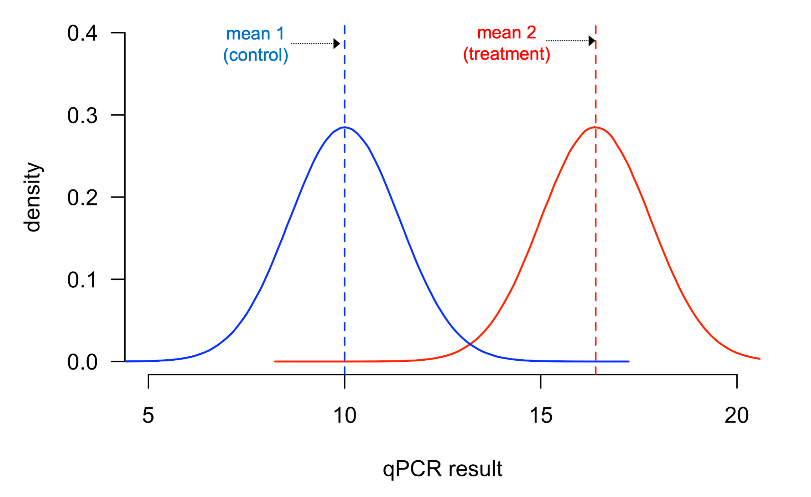
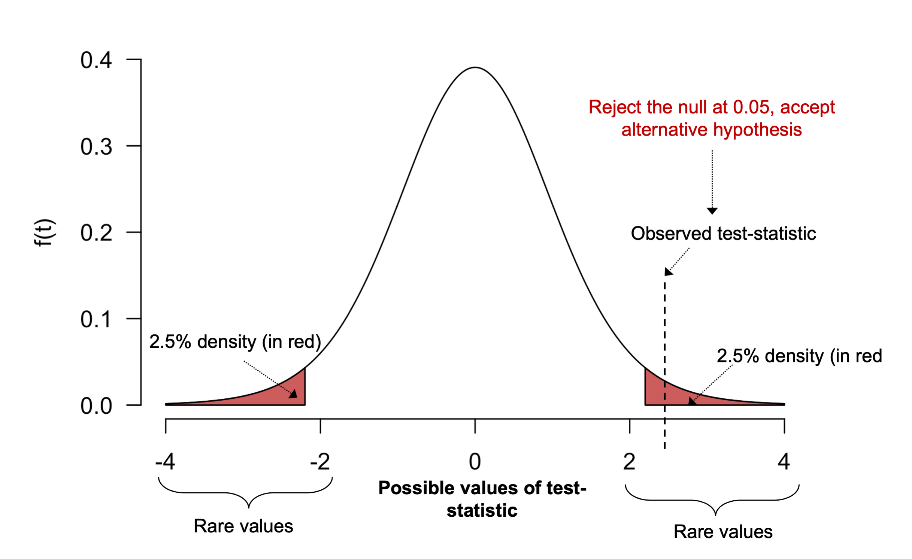
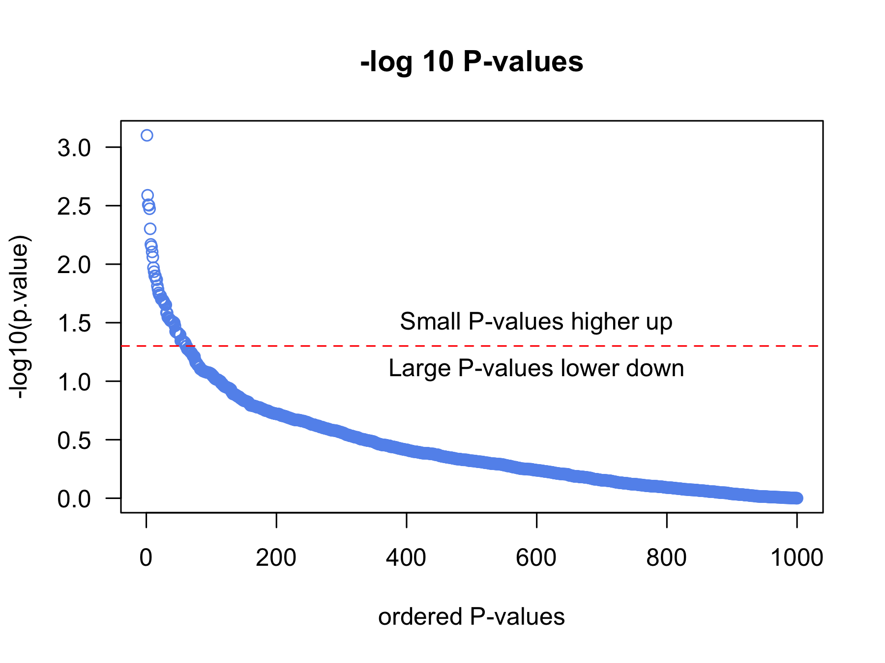
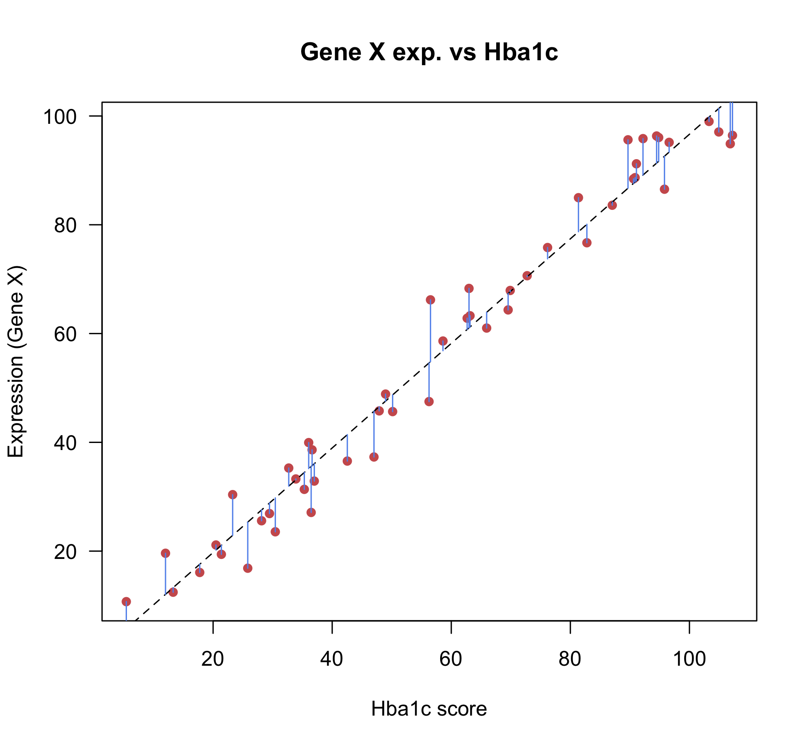
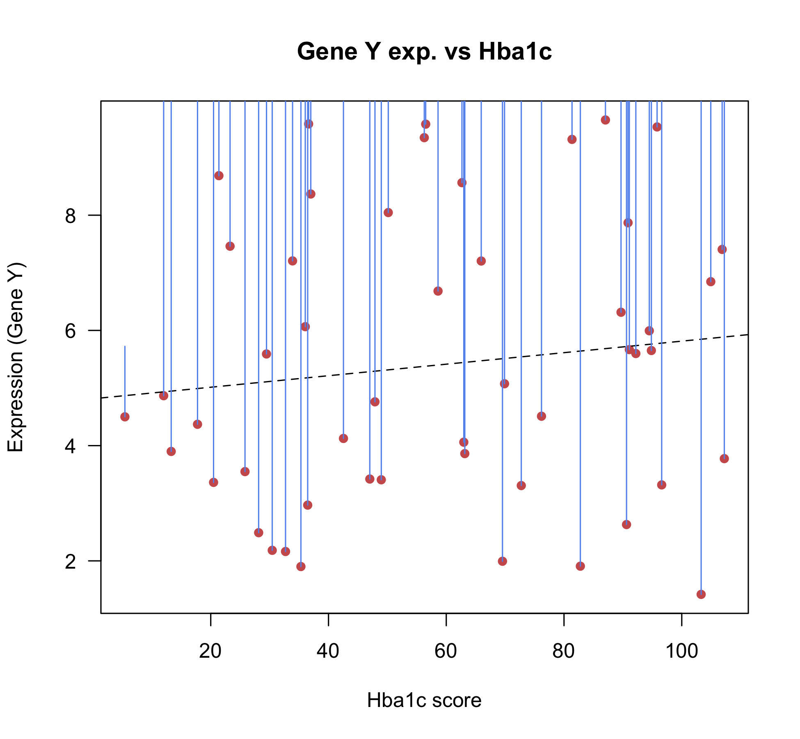
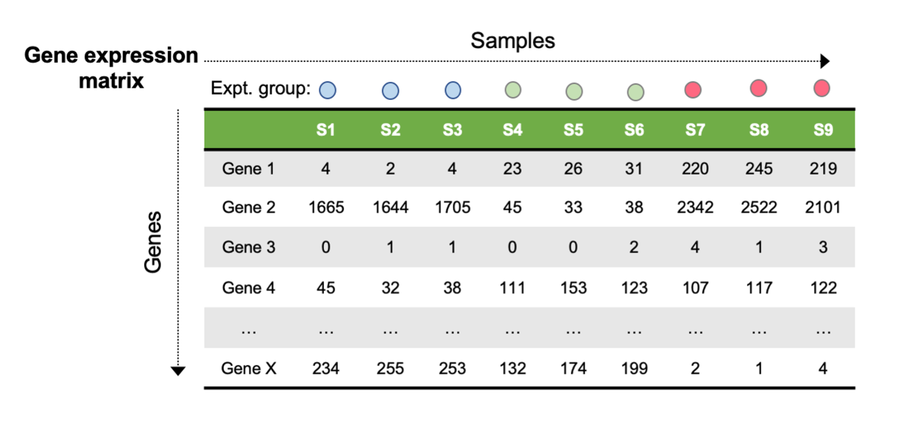

# Introduction to statistics for bioinformatics - Part II

## Supervised methods & statistical inference

### Statistical inference

Before we discuss supervised methods, it is useful to first discuss the fundamental concepts behind statistical inference, and importantly hypothesis testing, as we build the hypothesis testing framework to infer biological insights from data that has been modeled using supervised statistical approaches.

**Statistical inference** refers to the process we use to draw conclusions from models and procedures applied to the sample of the population we are studying, and is often broken down into two parts:
- **estimation** where we learn or determine a population parameter through fitting a statistical model fitted to our data (e.g. though using supervised learning approaches)
- **hypothesis testing** which involves testing for a specific value of this parameter, so that we can make an inference about the population from which the sample comes.

> An excellent article on the fundamentals of statistical inference and estimation from the *PennState course: Stat 504, Analysis of Discrete Data* is available [here](https://online.stat.psu.edu/stat504/node/16/).

---

### Hypothesis testing

In bioinformatic data analysis, we often conduct hypothesis testing to assess how meaningful our results are. For example, in RNA-seq analysis, we would like to know which genes showed meaningfully different gene expression between the experimental groups. **Hypothesis testing** describes the statistical framework that we use to assess how meaningful our results are.

**General procedure for hypothesis testing:**
1. Decide on the null hypothesis (*H<sub>0*, there is **no** meaningful difference* between our samples) 
2. Use the sample data to calculate a test statistic
3. Use the test-statistic to calculate a P-value
4. Reject the null hypothesis if P-value is below your *a priori* threshold

**To help understand the procedure for hypothesis testing, consider the below example:**
	
You have performed a qPCR experiment to examine how the expression levels of gene X change after treatment with a novel compound. You performed the experiment on 5 samples treated with the novel compund, and 5 samples treated with a control. You wish to determine if a significant differnece exists between the expression of gene X in the control and treatment groups. 

- The **Null hypothesis** is that there is no meaningful difference between the treatment groups. 
- The **Alternative hypothesis** is that a meaningful difference exists between the treatment groups. 

A common statistical test to compare the means between two groups of normally distirbuted data is the **t-test**, named due to the value upon which the test relies: the **t-statistic**. The t-statistic is an example of a *test-statistic*, a commonly used concept in statsitics that compares your results to those expected under the null hypothesis. 

<p align="center">
  
</p>

If the difference between the means of each sample group is large, and the standard deviation (spread of the data) is low, the t-statistic will have a larger value. If the means are closer together, or the standard deviation is large, the t-statistic will be small. In the below example, you can see the difference between the means seems quite large, and the spread of each distribution does not seem excessive, suggesting we might expect a large t-statistic for these data. 
	
<p align="center">
  
</p>	
	
Test-statistics such as the t-statsitic are assumed to follow known distribution that we assume was generated by repeatedly drawing samples from a population where the null hypothesis is true. In the case of the t-statistic, we assume this value to come from the **t-distribution**. 
	
<p align="center">
  
</p>

> Note that the t-distribution varies depending on a quantity referred to as *degrees of freedom* (sample number - 1), therefore the distribution will be slightly different each time our sample size for an experiment changes. 
	
Since the t-distribution was generated in a population where the null hypothesis is true, the value of the t-statistic tells us about the probability our data was generated under the null hypothesis:
- a t-statistic of 0 suggests there is no difference than expected under the null hypothesis 
- a **larger** (non-zero) test-statistic suggests the t-statistic is different from that expected under the null

We can use the t-statistic to calculate the probability that this result was generated under the null hypothesis. This probability is referred to as a **P-value** and represents the area under the t-distribution made up of values larger than the t-statistic we observed. Given the shape of the t-distribution, large t-statistics are less probable under the null hypothesis, so will be assigned a small P-value. 
	
In this example, the t-statistic is large enough that less than 5% of the t-distribution has a larger value, therefore our P-value will be < 0.05. 
	
<p align="center">
  
</p>

If we use the common P-value threshold (&alpha;) of 0.05, we should choose to accept the alternative hypothesis and reject the null. Intuitively, we can interpret this result as meaning that there is less than a 5 in 100 probability of the finding being due to chance. 
		
In R, we could perform the t-test as follows: 
```r
# make numeric vectors containing your data 
control <- c(10.548, 9.979, 8.388)
tx <- c(17.89 ,16.66, 17.73)

# run the test 
t.test(control, tx)
```

The test-statistic and distribution will change depending on the type of statistical test you need to run based on your data, but the overarching procedure for **hypothesis testing** remains the same as presented here. 

> **Definition:** The P-value can be generally defined as: **probability of observing data equal to or more extreme than that observed due to chance**. 
	
> **P-value thresholds:** Although 5% is a commonly used P-value threshold, you can be more or less stringent depending on the nature of your experiment: if you want to be very conservative and restrict your results to few results that are likely to be true positives, you may wish to restrict the results to a more stringent threshold. If your experiment is very preliminary and you care less about capturing some false positives than missing true positives, you may wish to relax your threshold.  

---

### The multiple testing problem

In bioinformatics, we measure thousands of features simultaneously (e.g. genes, peaks, methylation sites) and often run a statistical test for each of them. Given that P-values represent *the probability of observing data equal to or more extreme than that observed due to chance*, if we run enough tests, eventually we will obtain very small P-values simply due to chance, rather than because of a real effect.

Consider an RNA-seq experiment, where we test 20,000 genes for differential expression. If we set 5% as our &alpha;, we will **mistakenly claim** that 5% (1000 genes) of the genes we tested are significantly differentially expressed!

Different types of errors made in hypothesis testing are classified based on the actual truth in nature vs. the decisions we make during hypothesis testing.

<p align="center">
  
</p>

- False positives are generally referred to as **Type I error**.
- False-negatives are referred to as **Type II error**.

We can demonstrate the multiple testing problem by simulating some very simple data that come from exactly the same distribution, and therefore should have no significant differences between them, so we should never reject the null in theory.

```r
# generate an empty vector to store P-values in
p.value <- c()

# generate 2 random variables (r.v.s) 1000 times and run a t.test on each pair of r.v.s
# the r.v.s will have the same mean and distribution
for(i in 1:1000){
  # simulate random variables
  x <- rnorm(n = 20, mean = 0, sd = 1)
  y <- rnorm(n = 20, mean = 0, sd = 1)
  # run t.test and extract p-value
  p.value[i] <- t.test(x, y)$p.value
}

# count number of P-values less than our alpha
table(p.value < 0.05)

# order vector of P-values
p.value <- p.value[order(p.value)]

# visualize P-value magnitude
plot(-log10(p.value), las = 1,
     col = "cornflowerblue",
     main = "-log 10 P-values",
     xlab = "ordered P-values")
#### Note: taking -log10 of small number gives big number!

# add a horizontal line
abline(h=-log10(0.05), col = "red", lty = 2)

# add some useful labels
text(600, 1.5, "Small P-values higher up")
text(600, 1.1, "Large P-values lower down")
```

<p align="center">
  
</p>

Roughly 5% of the time, we commit a type I error. Left unchecked in genomics and bioinformatics studies, this error would cause a vast number of findings to be attributable to noise.

---

### Methods for multiple testing correction

We address this problem through *multiple testing correction*, which describes a number of statistical approaches for controlling the type I error rate, preventing us from making a large number of false positive claims.

#### Bonferroni correction

The simplest multiple testing correction method is the *Bonferroni* correction, which seeks to control the family-wise error rate (FWER): *the probability of making at least 1 false positive claim.*

To control for the FWER, the &alpha; threshold you have chosen for your experiment is divided by the number of tests performed, and any P-value must achieve significance below this threshold to be described as significant. In our example above where we ran 1000 tests at a 5% significance level, the correct alpha would be 0.05/1000 = 5e-5, so any P-value needs to be < 5e-5 to be deemed significant.

We can demonstrate this by plotting the Bonferroni threshold on the plot for our previous example:
```r
# visualize P-value magnitude
plot(-log10(p.value), las = 1,
     col = "cornflowerblue",
     main = "-log 10 P-values",
     xlab = "ordered P-values", ylim = c(0,5))

# add a horizontal line
abline(h=-log10(0.05), col = "red", lty = 2)
text(600, 1.5, "Original threshold")

# add a horizontal line
abline(h=-log10(0.05/1000), col = "red", lty = 2)
text(600, 4.5, "Bonferroni")
```

<p align="center">
  
</p>

We can also calculate a new set of P-values that have been adjusted by the Bonferroni method (P-values are multiplied by the number of comparisons), which can be evaluated at the 0.05 significance value.
```r
# bonferroni correction
p.adj.bonf <- p.adjust(p.value, method = "bonferroni")
p.adj.bonf

# check if any are signifciant
table(p.adj.bonf < 0.05)
```

By definition, Bonferroni correction guards against making even 1 false-positive, which is often too conservative in genomics experiments where we are using trying to generate new hypotheses in an exploratory fashion. Consequently, we often use other multiple testing correction methods in genomics, such as the false discovery rate (FDR).


#### False discovery rate

The *false discovery rate (FDR)* is a less conservative method of multiple testing correction, and therefore potentially more powerful, as it will lead to fewer false-negatives, at the expense of increased false positives (compared to Bonferroni).

FDR is defined as the proportion of false discoveries among all significant results. Controlling the false discovery rate at 5% means we accept 1 in 20 of the results we call significant are actually false positives.

<p align="center">
  
</p>

To control for the FDR, we can use a list of P-values to calculate a *q-value* for each of these P-values in our list. A *q-value* for a specific test is defined as expected proportion of false-positives among all features called as or more extreme than the one in question.

For example, if an individual gene for an RNA-seq differential expression analysis has a q-value of 0.01, this means 1% of genes with a lower significance value than this gene will be false-positives.  

You can calculate q-values using the Bioconductor package `qvalue`.
```r
#BiocManager::install("qvalue")
library(qvalue)
qvalue(p.value)$qvalues
p.adj.fdr <- qvalue(p.value)$qvalues

# check how many are sig.
table(p.adj.fdr < 0.05)
```

No results were identified as significant after correcting for multiple testing, which is what we expected should be true since we drew our random samples from the exact same distributions.

This example highlights the short coming of hypothesis testing approaches, and demonstrates how important it is to correct for multiple hypothesis testing. **Always perform multiple testing correction**.


An good summary of multiple testing correction in high throughput genomics experiments can be found [here](https://www.nature.com/articles/nbt1209-1135). An excellent video describing the FDR-based methods can be found [here](https://www.youtube.com/watch?v=K8LQSvtjcEo&ab_channel=StatQuestwithJoshStarmer) by StatQuest.


---

### Supervised learning - Linear modeling

Simple linear models, or linear regression, is used pervasively in bioinformatics and genomics for statistical inference. Linear models are relatively simple, flexible, & interpretable, meaning they make excellent tools for statistical inference and scale well to thousands of observations, which is critical for common genomics datasets. Example applications of linear models include:  
- RNA-seq (differential expression)
- ChIP-seq (differential binding)
- ATAC-seq (differential accessibility)
- Microarray analysis (e.g. DNA methylation)
- Variant identification (WES/WGS/RNA-seq)
- Genome-wide association studies (GWAS)

Understanding the basics of linear modeling is central to being able to perform these types of analyses in a statistical programming environment such as R. Given their importance and pervasive use in bioinformatics and genomics, we will introduce the fundamental concepts of linear models, and how you can fit these models in R.

> **Note:** Linear modeling is the topic of entire independent courses and again requires knowledge of appropriate mathematics and probability to understand completely. This lesson should be considered an introduction rather than a standalone resource.

Consider the key components of a simple linear model:
`response = predictor(s) + error`

- **The *response*** is the dependent variable we wish to model based on some set of predictors  

- **The *predictor(s)*** is the independent variable(s) that we wish to model as a linear combination of the response

- **The *error*** component represents the information not explained by the model (the models *residuals*)

We assume a *response* variable (*Y*) can be represented as a linear combination of some *predictors* (*X*, independent variable(s) ). The model estimates a set of *coefficients* that explain how the *predictors* are related to the *response*. We can use these *coefficients* for statistical inference to better understand which predictors are associated with our response, or for applying the model to new data where we wish to predict the response variable using only a set of predictors.

Using the statistical notation for a simple linear regression model:

Y = &beta;<sub>0</sub> +  &beta;<sub>i</sub> X<sub>i</sub> + &epsilon;

- Y is a continuous response variable that we assume is normally distributed
- &beta;<sub>i</sub> are the coefficients to be estimated (&beta;<sub>i</sub>-value)
- X<sub>i</sub> are the predictors
- &beta;<sub>0</sub> refers to the model intercept
- &epsilon; refers to the error term (residuals) and are assumed to follow a normal distribution

Each predictor is associated with a coefficient (also called the *slope*) that describes the relationship of that predictor to the response variable.

---

#### Fitting linear models in R

In R, the basic syntax for a linear model is: `lm(response ~ predictor)`. Lets simulate some data that we can use to illustrate the theory described above and fit our first linear model in R.

```r
# read in the example data
dat <- read.csv("lm-example-data.csv", stringsAsFactors=FALSE)

# explore it quickly
head(dat)
str(dat)

# plot
plot(dat$gene_exp ~ dat$hba1c,
	ylab = "Expression (Gene X)",
	xlab = "Hba1c score",
	main = "Gene X exp. vs Hba1c",
	col = "indianred", pch = 16, las = 1)

# fit a linear model with gene expression as the response
lm1 <- lm(dat$gene_exp ~ dat$hba1c)
lm1
```


The coefficient for the independent/predictor variable, Hba1c, describes its relation to the response variable, expression of gene X. Here, the coefficient is telling us that *for every 1 unit increase in gene expression measured, Hba1c levels increase by ~0.96 units*.

This is basic *statistical inference*, as we have used this procedure to model the relationship between two variables, and *infer* something about how those variables are related.

To help us better understand the model, we can plot the regression line on our scatterplot.
```r
# generate plot again
plot(dat$gene_exp ~ dat$hba1c,
	ylab = "Expression (Gene X)",
	xlab = "Hba1c score",
	main = "Gene X exp. vs Hba1c",
	col = "indianred", pch = 16, las = 1)

# add the model on the scatterplot
abline(lm1, lty=2)

# calculate the predicted gene expression values using the model
pre <- predict(lm1)

# plot the difference between the predicted and the true values
segments(dat$hba1c, dat$gene_exp, dat$hba1c, pre,
	col="cornflowerblue")
#### Note: These are the residuals!
```


The regression line (shown in black) illustrates the clear linear relationship between expression of gene X and Hba1c levels.

The residuals (blue lines) describe how far away each observation (the gene expression values) are from the predicted values from the linear model. All observations are close to the regression line, suggesting the model is a good fit for the data.

**However**, by virtue of this being a statistical model, all coefficients are estimated with some level of uncertainty. If the model is a poor fit for the data, there will be a high uncertainty in the coefficient. To evaluate how much meaning we should attribute to the coefficient, we can calculate a *P*-value for it through hypothesis testing, which we will explore below.

> **Note:** Although standard models for modeling gene expression data would include expression values as the response variable, these models usually take on a more complicated form (see note on *Generalized linear models* at the end of this lesson), however we have set up a simple model for teaching purposes.

---

#### Hypothesis testing with linear models

In order to test how much certainty we have for a particular coefficient from a linear model, we estimate a quantity called **the standard error (SE)**. Without discussing the underlying statistics that define it, the SE is essentially a *measure of certainty around the coefficient*, and is dependent on the variance of the residuals (&epsilon;).

Importantly, the SE can be used to perform **hypothesis testing** to determine if the coefficient is statistically significant. In this case, we can test the null hypothesis that the coefficient is equal to zero, using the following equation to calculate the *t-score*:

*t-score* = (&beta;<sub>i</sub>) - 0 / SE(&beta;<sub>i</sub>)

The *t-score* can then be used to calculate a *P*-value, as described in the hypothesis testing section. In R, the `summary()` function will test all model coefficients against the null hypothesis:
```r
sum_lm1 <- summary(lm1)
sum_lm1

# get the coefficients table
coef(sum_lm1)

# get the coefficients themselves
coef(sum_lm1)[,1]

# get the P-value for the hba1c coefficient
coef(sum_lm1)[2,4]
```

The *P*-value is very small, so we can reject the null, and conclude that Hba1c levels are associated with expression of gene X, and interpret the coefficient as a meaningful quantity.

If the *P*-value does not pass the *a priori* significance threshold for your analysis, the coefficient should be ignored as that predictor is **not associated** with the response variable.

You can always confirm by looking at the slope in a simple linear model. To demonstrate this, explore the example below for Gene Y and its relation to Hba1c levels.
```r
# read in the example data
dat2 <- read.csv("lm-example-data-geneY.csv", stringsAsFactors=FALSE)

# plot
plot(dat2$gene_exp ~ dat2$hba1c,
	ylab = "Expression (Gene Y)",
	xlab = "Hba1c score",
	main = "Gene Y exp. vs Hba1c",
	col = "indianred", pch = 16, las = 1)

# fit a linear model with gene expression as the response
lm1 <- lm(dat2$gene_exp ~ dat2$hba1c)
summary(lm1)
pre <- predict(lm1)

# add the model on the scatterplot
abline(lm1, lty=2)

# plot the difference between the predicted and the true values
segments(dat2$hba1c, dat2$gene_exp, dat2$hba1c, pre, col="cornflowerblue")

```




The flatter slope of the regression line, and larger values of the residuals, suggests there is no useful relationship between Hba1c levels and expression of gene Y, which is supported by the large *P*-value returned by the model.

---

#### Simple Linear modeling with categorical variables

In genomics, we commonly have categorial predictor variables, in contrast to the continuous variable (Hba1c) from our example above. Example of categorial variable include:
- Wild-type vs knockout
- Vehicle vs treatment
- Control vs diseased

Importantly, linear models are capable of incorporating categorical variables as predictors. Lets consider another example, where we have gene expression levels for gene X measured in 20 healthy tissues, and 20 diseased tissues, and we wish to use a linear model to explore the relationship between gene expression and disease status.

```r
# read in the example data
dat3 <- read.csv("lm-example-3.csv", stringsAsFactors=FALSE, row.names = 1)

# quickly explore it
head(dat3)
table(dat3$subject_group)
# Note: Controls are coded as 0, cases are coded as 1

# visualize the data
boxplot(dat3$exp_geneX ~ dat3$subject_group ,
     ylab = "Expression (Gene X)",
     xlab = "Subject group",
     main = "Gene X exp. vs Hba1c",
     col = c("indianred", "cornflowerblue"), pch = 16, las = 1)


# run the linear model and evaluate
lm_2 <- lm(dat3$exp_geneX ~ dat3$subject_group)
summary(lm_2)
```


Looking at the model output, the *P*-value is very small, therefore we can conclude that there is an association between expression of gene X and disease status in this sample.

Again, the coefficient tells us about the relationship between the predictor and the response. The coefficient for the predictor `subject_group` tells us that for each unit increase in this variable, there is an increase of 11.2 expression units for gene X.

Since a 'unit increase' in `subject_group` simply means controls vs diseased subjects, we can interpret this as the difference in expression between controls and cases. This is analogous to how we would calculate a fold-change value in an RNA-seq analysis.

---

#### Final Note: Beyond simple linear models for NGS data analysis

While standard linear models are very useful, there are many situations in analysis of NGS data where their use is not appropriate. NGS data are **count-based**, since most applications rely on counting read numbers and using these for inference.

Count-based data have two major properties that violate the basic requirements for the dependent variable (Y) in basic linear models:
- their values are restricted (i.e. must be positive integer)
- the variance of an individual observation from such NGS count data depends on the mean

To address these issues, a family of statistical models called ***Generalized linear models (GLMs)*** are commonly used for analysis of NGS data. GLMs are an extension of more simple linear models that address the above limitations and allow their application to count data.

RNA-seq data is an excellent example, since we need to model read counts to make inferences on what we really care about: expression levels. Common software packages for differential expression analysis such as [DESeq2](http://bioconductor.org/packages/release/bioc/html/DESeq2.html) & [edgeR](https://www.bioconductor.org/packages/release/bioc/html/edgeR.html) utilize GLMs.

<p align="center">

</p>

While an comprehensive introduction to GLMs is beyond the scope of the workshop, this topic is covered in many good statistical textbooks and online/in-person courses. Below are some suggested (but not comprehensive) resources for learning more about GLMs.

- edX course: [Data Analysis for the Life Sciences](https://www.edx.org/professional-certificate/harvardx-data-analysis-for-life-sciences)
- Coursera course: [Generalized Linear Models and Nonparametric Regression](https://www.coursera.org/learn/generalized-linear-models-and-nonparametric-regression)
- Book: [An Introduction to Generalized Linear Models, Annette J. Dobson, Adrian G. Barnett](https://www.routledge.com/An-Introduction-to-Generalized-Linear-Models/Dobson-Barnett/p/book/9781138741515)
- PennState STAT-504 lesson: https://online.stat.psu.edu/stat504/lesson/6/6.1

If you plan to do a significant amount of downstream statistical analysis of NGS data, a working knowledge of GLMs will be extremely valuable.  

> Note: We cover the fundamentals of how GLMs are used in the context of RNA-seq data analysis in our RNA-seq data analysis workshop, typically offered in the summer.
