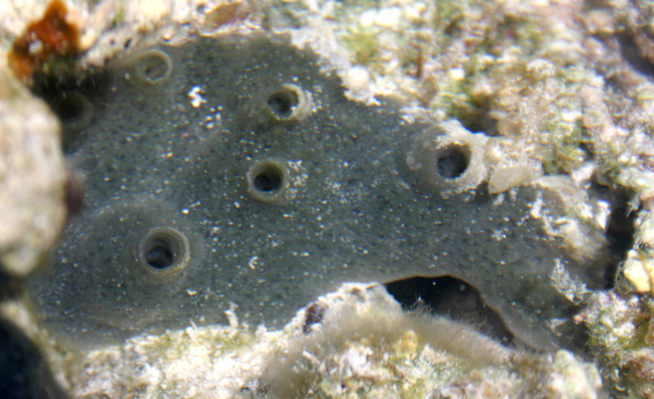

# Optional Exercise: Using the *BioStrings* package for sequence analysis

This optional exercise accompanies lesson *Working with genomics data in R/Bioconductor - Part II*. You may complete this exercise at home after the workshop, or during any session where you have extra time.

---

### Basic object-classes and methods in the BioStrings package

BioStrings implements a number of basic object-classes to store sequence data, as well as methods to parse these sequences and perform complex tasks on them.

The most basic object class in BioStrings is the *XString* class, which is technically a '*virtual class*' (meaning it cannot actually store objects itself, but can be used to set rules for a a group of classes) encompassing object classes for DNA, RNA, and protein sequences: `DNAString`, `RNAString`, and `AAString`. Today we will focus on DNA sequences using DNAString class objects.

Lets start by creating a simple DNAString object and looking at some of its basic features:
```r
# use the DNAString constructor function to create a 10 letter DNA sequence
seq <- DNAString(x="AGCT", start=1, nchar=NA)
seq

# how long is it
length(seq)

# show the structure of the DNAString object
str(seq)
```

Now we will make a longer sequence using the pre-stored BioStrings object `DNA_ALPHABET` and some functions from base R.
```r
# print DNA alphabet to see what it returns
DNA_ALPHABET
```

The four standard DNA bases are returned as the first 4 elements of this character string. The remaining elements represent ambiguous bases or specific combinations/relationships using something called the *extended The International Union of Pure and Applied Chemistry (IUPAC) genetic alphabet.* BioStrings and its object classes use the extended IUPAC genetic alphabet to describe nucleic acid sequences, therefore we will briefly cover the basics of the extended IUPAC alphabet now.

The extended IUPAC code is a nomenclature used to describe incompletely specified nucleic acids. This is useful when dealing with reference genomes, as we often encounter regions with ambiguous assemblies. The standard IUPAC code uses 16 characters to specify both single bases (A, G, C, T, U) or the possible states for that base.

The standard IUPAC code is used by numerous bioinformatics tools and softwares in order to represent complex sequences of nucleic acids for which we may not be confident in some individual base identities (e.g. complex genomic regions that are challenging to sequence using short read approaches).

**Table 1. Standard IUPAC genetic alphabet.**

|Symbol |	Mnemonic| Translation  |
|---|---|---|
| A	|	A | (adenine) |  
| C	|	C | (cytosine)  |
| G	|	G	| (guanine)  |
| T	|		T	| (thymine)  |
| U	|		U	| (uracil)  |
| R	|	pu**R**ine		| A or G  |
| Y		| p**Y**rimidine		| C or T/U  |
| S		| **S**trong interaction	|	C or G  |
| W		| **W**eak interaction		| A or T/U  |
| M		| a**M**ino group		| A or C  |
| K		| **K**eto group		| G or T/U |   
| H		| not G		| A, C or T/U |   
| B		| not A		| C, G or T/U |  
| V		| not T/U		| A, C or G |  
| D		| not C		| A, G or T/U |  
| N		| a**N**y		| A, C, G or T/U |  
| - | none | Gap  

This table was adapted from [Johnson, 2010, *Bioinformatics*](https://www.ncbi.nlm.nih.gov/pmc/articles/PMC2865858/#B1).

An extended IUPAC genetic alphabet was also described in 2010 [(Johnson, 2010, *Bioinformatics*)](https://www.ncbi.nlm.nih.gov/pmc/articles/PMC2865858/#B1). The extended code uses additional characters, underlining, and bolding as well as the original 16 character code (all meanings maintained) to denote all possible combinations or relationships between bases. Among other uses, this has been valuable for representing genetic variation in DNA sequences. You can explore the details on the extended code in Tables 2 & 3 of [(Johnson, 2010)](https://www.ncbi.nlm.nih.gov/pmc/articles/PMC2865858/#B1).

If you're working with BioStrings objects, and need a reminder of the basic characters of the extended code, you can just type `IUPAC_CODE_MAP` when you have the BioStrings package loaded into your R session.

```r
# print iupac code to console
IUPAC_CODE_MAP
```

For now, we will use use the standard, unambiguous DNA bases (A, G, C, T) for some examples.
```{r}
# randomly sample from specific characters in DNA_ALPHABET to create a longer sequence
seq = sample(DNA_ALPHABET[c(1:4)], size=100, replace=TRUE)
seq

# use the paste command to collapse the characters into a single string
seq = paste(seq, collapse="")
seq

# use the DNAString constructor function to turn this sequence into a DNAString class object
seq.dnastring <- DNAString(seq)
seq.dnastring
```

Now collect some basic information on your sequence.
```r
# confirm how long it is
length(seq.dnastring)

# what is the frequency of each base in your sequence
alphabetFrequency(seq.dnastring, baseOnly=TRUE, as.prob=TRUE)

# what is the frequency of your favourite base (which is obviously Adenine)
letterFrequency(seq.dnastring, "A", as.prob=TRUE)

# return the frequency of dinucleotide pairs
dinucleotideFrequency(seq.dnastring, as.prob=TRUE)

# or even trinucleotides
trinucleotideFrequency(seq.dnastring, as.prob=TRUE)
```

We can also perform some basic manipulations of our sequence using BioStrings functions.
```r
# subset the sequence for 10 specific bases of interest  
seq.dnastring[10:19]

# this can also be done with the `subseq()` function  
subseq(seq.dnastring, 10, 19)

# get the reverse of our sequence
reverse(seq.dnastring)

# get the reverse COMPLEMENT sequence
reverseComplement(seq.dnastring)

# get the reverse complement of the first 10 bases in your sequence
reverseComplement(subseq(seq.dnastring, 1, 10))

# translate our DNA sequence
translate(seq.dnastring)
```

Again, our example is a little impractical since we are usually working with a set of sequences, for example the chromosomes in a reference genome. This is where the `DNAStringSet` object class becomes useful. `DNAStringSet` allows you to store, name, and manipulate multiple sequences in one BioStrings object.
```r
# remove the old single sequence from our global R environment
rm(seq)

# create a new variable, and fill it with individual sequences created as we did above
seq.dnass <- NULL
seq.dnass[1] = paste(sample(DNA_ALPHABET[c(1:4)], size=50, replace=TRUE), collapse="")
seq.dnass[2] = paste(sample(DNA_ALPHABET[c(1:4)], size=50, replace=TRUE), collapse="")
seq.dnass[3] = paste(sample(DNA_ALPHABET[c(1:4)], size=50, replace=TRUE), collapse="")
seq.dnass[4] = paste(sample(DNA_ALPHABET[c(1:4)], size=50, replace=TRUE), collapse="")
seq.dnass[5] = paste(sample(DNA_ALPHABET[c(1:4)], size=50, replace=TRUE), collapse="")
seq.dnass

# how long is this object
length(seq.dnass)

# use the constructor function DNAStringSet to make the DNAStringSet object with your sequences
dna.st.set = DNAStringSet(seq.dnass)

# how long is the DNAStringSet object
length(seq.dnass)

# name all your sequences
names(seq.dnass) = paste("barcode-", 1:5, sep="")
seq.dnass
```

Like XString, a virtual class exists for `DNAStringSet` class objects called *XStringSet*, which also contains object classes for storing RNA and AA sequences (`RNAStringSet` and `AAStringSet`).


---

### Example: Analyzing custom sequences with *BioStrings*

BioStrings can be used to analyze any set of sequences you are able to define in your R environment as an *XString* or *XStringSet* class object. For example, perhaps you have a FASTA file containing some sequences of interest from the organism you studying, *Amphimedon queenslandica*, a marine sponge organism native to the Great Barrier Reef, and want to explore some basic features of its coding sequences.

<p align="center">

</p>

Image source: [Wikipedia](https://en.wikipedia.org/wiki/Amphimedon_queenslandica)

We can retrieve a FASTA file for the coding sequences  (13 overall) from NCBI [(RefSeq ID: NC_008944.1)](https://www.ncbi.nlm.nih.gov/genome/2698) and read the FASTA file into R as a DNAStringSet object using the `readDNAStringSet()` function.

```r
fasta.file <- "a.queenslandica.fasta"
a.queen <- readDNAStringSet(fasta.file, "fasta")
a.queen
```

Just as we have done earlier in this lesson, we can again use the BioStrings functions to perform basic operations on these sequences. For example:
```r
# confirm how long it is
length(a.queen)

# what is the frequency of each base in your sequence
base.freqs <- alphabetFrequency(a.queen, baseOnly=TRUE, as.prob=TRUE)
base.freqs

# what is the frequency of your favourite base
a.freqs <- letterFrequency(a.queen, "A", as.prob=TRUE)
a.freqs
```

BioStrings also implements extensive functionality for **pattern matching**, allowing you to search sequences for specific patterns of interest. For example, we may want to confirm that each of our coding sequences begins with an `ATG` start codon. We can do this using the BioStrings functions `matchPattern()` and `countPattern()`.
```r
# return all matches in a DNAString subject sequence to a query pattern
matchPattern("ATG", a.queen[[1]])

# only return how many counts were found
countPattern("ATG", a.queen[[1]])

# what happens if we remove the indexing of the DNAStringSet object 'a.queen'? Why?
matchPattern("ATG", a.queen)

# match a query sequence against multiple sequences that you want to search in  
vmatch <- vmatchPattern("ATG", a.queen)
vmatch

# look at the structure of this object
str(vmatch)

# extract the IRanges for matches in the first subject sequence
vmatch[[1]]
```

We may also have several patterns that we want to search for in each our coding sequences. For example, perhaps we want to search for standard stop codons (`TAG`, `TAA`, `TGA`) in the *A.queenslandica* coding sequences. BioStrings functions `matchPDict()` and `vmatchPDict()` provide functionality for such tasks. e.g.
```r
# create a DNAStringSet of the stop codons
stop.codons <- DNAStringSet(c("TAG", "TAA", "TGA"))

# create a dictionary of patterns (PDict class object) that you want to search your sequences for
stop.codons.dict <- PDict(stop.codons)

# search in the first coding sequence
match1 <- matchPDict(stop.codons.dict, a.queen[[1]])
match1
match1[[3]]

# use a loop to search for stop codons in all our coding sequences
matches <- list()
for(i in 1:length(a.queen)){
  matches[[i]] <- matchPDict(stop.codons.dict, a.queen[[i]])
}
length(matches)
str(matches)
matches[[4]]
matches[[4]][[3]]
```

---

#### Other functionality in BioStrings

BioStrings also provides functionality for a number of other analytical tasks that you may want to perform on a set of sequences stored using the *XString* and *XStringSet* method, for example:  
* trimming sequence ends based on pattern matching using `trimLRPatterns()`
* local and global alignment problems using `pairwiseAlignment()`
* read in multiple sequence alignments using `readDNAMultipleAlignment()`
* motif searches with a Position Weight Matrix (PWM) using `matchPWM()` (commonly done in ChIP-seq & ATAC-seq)
* palindrome searching using findPalindromes `findPalindromes()`
* computing edit distances between sets of sequences using `stringDist()`  
