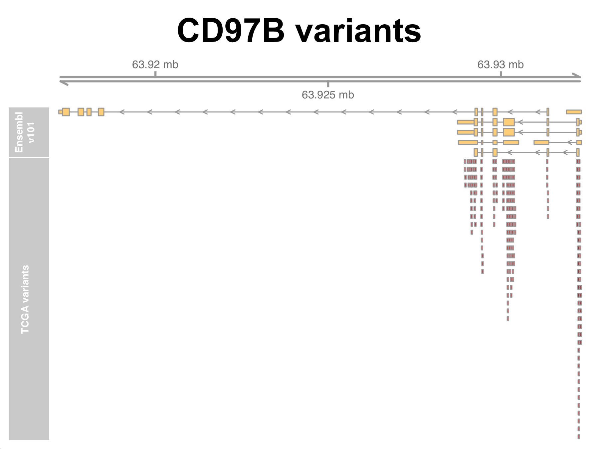

# Optional Exercise: Transcript-specific annotation with Bioconductor

This optional exercise accompanies lesson *Working with genomics data in R/Bioconductor - Part II*. You may complete this exercise at home after the workshop, or during any session where you have extra time.

---

Another core Bioconductor package is the **GenomicFeatures** package, which implements the *TxDb* object class, and provides a convenient and efficient way to store and access transcript specific data from a genome annotation. TxDb objects store a wide-range of transcript-specific information including coordinates and sequences for promoters, exons, introns, and untranslated regions (UTRs).

TxDb objects for common genome annotations can be loaded directly by calling the corresponding annotation package. We can view the available TxDb packages by going to the Bioconductor website and using the search tool. Lets start by loading the TxDb package for the human genome and having a look at the contents.
```r
library(TxDb.Hsapiens.UCSC.hg38.knownGene)

# assign to txdb variable
txdb <- TxDb.Hsapiens.UCSC.hg38.knownGene
txdb
```

You can see this available TxDb object is for gene annotations generated under the UCSC annotation pipeline. What if your genome is not included in the available TxDb packages, for example, if we wanted to continue using an Ensembl annotation? Or perhaps there is no pre-constructed TxDb object available for your organism. GenomicFeatures provides a number of functions specifically to address these issues, for example:  
* `makeTxDbFromEnsembl()` - Construct a TxDb object from Ensembl
* `makeTxDbPackageFromBiomaRt()` - Construct a TxDb object from Biomart
* `makeTxDbPackageFromGFF()` - Construct a TxDb object from a GFF/GTF file

Lets construct a TxDb object from the latest release for human genes from Ensembl. We won't actually build it from scratch right now as it takes a bit of time, but we have a pre-made TxDb ready for you to read into your environment and work with.
```r
#### DO NOT RUN ####
txdb <- makeTxDbFromEnsembl("homo_sapiens", release = 101)

Fetch transcripts and genes from Ensembl ... OK
Fetch exons and CDS from Ensembl ... OK
Fetch chromosome names and lengths from Ensembl ...OK
Gather the metadata ... OK
Make the TxDb object ... OK

#### DO RUN ####
### If you have not already done so you will first need to unzip this file before loading it
txdb <- loadDb("TxDb.Hsapiens.Ensembl.101.db")
txdb
```

Printing the object to the console tells us some basic information about the annotation. For example, you can see the data include hundreds of thousands of rows for unique transcripts, exons, and coding sequences. We can access this information with some basic accessor functions provided by the GenomicFeatures package.
```r
# retrieve all transcript level info
txs <- transcripts(txdb)
txs

# what class is it?
class(txs)

# how long is it
length(txs)

# what is the distribution of transcripts across strands
table(strand(txs))
```

The `transcripts()` function conveniently returns a GRanges class object. This means we can apply all the same methods and accessor functions we used in the previous lesson to the transcript data here (e.g. `seqnames()`, `strand()`, `findOverlaps()`, etc.). There are also several other useful accessor functions that we can use to return specific subsets of the data in our TxDb object.
```r
# retireve all the exon ranges
ex <- exons(txdb)

# retireve all the gene ranges
ge <- genes(txdb)

# promoter ranges for a specified width around TSS
prom <- promoters(txdb, upstream=1000, downstream=0)

# non-overlapping introns or exons
# these commands each take a minute to run
exonicParts(txdb)
intronicParts(txdb)
```

Some of these ranges might be more useful if they were organized by their relation to a specific transcript or gene. There are several accessor functions that provide functionality to achieve this, and return a GRangesList class object rather than ordinary Granges objects.
```r
# return all transcript ranges organized by gene
txs_by_gene <- transcriptsBy(txdb, by = "gene")
txs_by_gene

# index by gene.id of interest to get all transcripts annotated to that gene
txs_by_gene["ENSG00000000419"]

# index by exons by transcript (to identify unique exons)
ex_by_gene <- exonsBy(txdb, by = "tx")
ex_by_gene
```

Equivalent functions exist to return organized GRangesLists for specific features, including:  
* `exonsBy()` - exons by feature
* `intronsByTranscript()` - introns by transcript
* `exonsByTranscript()` - exons by transcript
* `threeUTRsByTranscript()` - 3'UTRs by transcript
* `fiveUTRsByTranscript()` - 5'-UTRs by transcript

Data can also be accessed from a TxDb object using the `select()` method with the `columns` and `keytypes` arguments just as we did for *OrgDBb* objects. This convenient approach is made possible by the fact that *TxDb* objects inherit from *AnnotationDbi* objects, just as *OrgDb* objects do. Using `select` in this way allows us to return data for a large list of features, or a specific subset that we request using the `keys` argument. For example, we might wish to return transcript to gene mapping for specific gene IDs, or we may want to obtain all the exon IDs and their genomic location info for a specific set of transcripts.
```r
# look at the columns available to be returned in the Txdb
columns(txdb)

# return the transcripts annotated to a specific gene of interest
gene_to_tx <- select(txdb, keys = "ENSG00000273696", columns="TXNAME", keytype="GENEID")
gene_to_tx

# return tx to gene mapping for top 500 RNA-seq diff. exp. results
gene_to_tx <- select(txdb, keys = head(rownames(results), 500) ,
                     columns="TXNAME",
                     keytype="GENEID")
head(gene_to_tx)
dim(gene_to_tx)

# check for duplicate entries
table(duplicated(gene_to_tx$GENEID))
table(duplicated(gene_to_tx$TXNAME))

# return exons IDs, their coordinates, and strand for top 10 transcripts from RNA-seq results
tx_to_exon <- select(txdb, keys = head(gene_to_tx, 10)$TXNAME ,
                      columns=c("EXONCHROM", "EXONNAME", "EXONSTART",
                      "EXONEND", "EXONSTRAND", "GENEID"),
                      keytype="TXNAME")

# again, check for duplicate entries
table(duplicated(tx_to_exon$TXNAME))
```

---

### Example application: Variant annotation

Transcript annotation data can be used in many ways. One common usage example is in the annotation of variant calls, where we need to identify the transcriptional context of a variant set (e.g. promoter-associated, exon, intron, untranslated regions, etc.).

To demonstrate how we could achieve this in Bioconductor, we will also use the `VariantAnnotation` package that uses TxDb objects directly to annotate a set of variants. An example set of variant calls is provided, representing variants present over multiple cancer types, identified as part of The Cancer Genome Atlas (TCGA) [*Pan-Cancer Analysis of Whole Genomes (PCAWG) project*](https://www.nature.com/articles/s41586-020-1969-6). Genomic coordinates (hg38) for all identified variants present on chromosome 17 are included in the file `../data/TCGA.pcawg.chr17.bed`.

> Note that *'variant annotation'* also commonly includes annotating variants with their functional consequence

To demonstrate how we could use our TxDb object created above to annotate variants, we will leverage functionality from another BioConductor package, `VariantAnnotation` that uses TxDb objects directly to annotate a set of variants (that can be in GRanges format).

```r
library(VariantAnnotation)

# import the variant locations in bed file format
bed <- import("data/TCGA.pcawg.chr17.bed", format="BED")
bed

# annotate the variants based on our Ensembl Txdb
vars <- locateVariants(bed, txdb, AllVariants())
vars
```

As you can see by printing this object to the console, we now have variants annotated by their transcriptional context, as it relates to the human Ensembl annotation release 101. We can perform some simple operations on this object to explore it further and answer some basic questions, such as how many variants are annotated in each group variant class.

```r
# sum up variants in each group
sum.tab <- table(vars$LOCATION)
sum.tab

# calculate a quick proprtions table
round(prop.table(sum.tab), digits = 2)

# quick visualization
barplot(round(prop.table(table(vars$LOCATION)), digits = 2))
```

It would also be nice to have the gene symbols included in the TxDb object. We can add gene symbols in the same way we did using above using annotation data downloaded from Biomart. For these data, we need annotation release 101, which has been provided for you in the `Day-3/data/` directory.
```r
#
anno <- read.table("GRCh38.p12_ensembl-101.txt", sep="\t", header=TRUE, stringsAsFactors = F)

# return indicies of ENSEMBL geneIDs from variants annotation in the Ensembl v101 annotation data
indicies_of_matches <- match(vars$GENEID, anno$Gene.stable.ID)

# add gene symbols to vars object
vars$GENE.SYMBOL <- anno$Gene.name[indicies_of_matches]
```

Adding gene symbols allows us to easily search for genes of interest, by their transcript ID, gene ID, or gene symbol. We demonstrate this below by restricting to variants identified in the *CD79B* gene.
```r
# exmaple gene of interest:
vars_cd79b <- vars[vars$GENE.SYMBOL %in% "CD79B",]
vars_cd79b

# check how many of each variant type
table(vars_cd79b$LOCATION)
```

We could also use the visualization approaches we learned in the last lesson to plot the variants in this region using the `Gviz` package.
```r
# required to set expectation for format of chromosome names ('chr17' vs '17')
options(ucscChromosomeNames=FALSE)

# set gene region track from our txdb
txTr <- GeneRegionTrack(txdb,
                        chromosome = "17",
                        start = (min(start(vars_cd79b)) - 500),  
                        end =  (max(start(vars_cd79b) + 500)),
                        name = "Ensembl v101")

# create the annotation track for the variants of interest
track1 <- AnnotationTrack(granges(vars_cd79b), name = "TCGA variants",
                          col.line = "red", fill = "red")

# add the genome axis for scale
gtrack <- GenomeAxisTrack()

# generate the plot
plotTracks(list(gtrack, txTr, track1), main="CD97B variants")
```

<p align="center">

</p>

---
